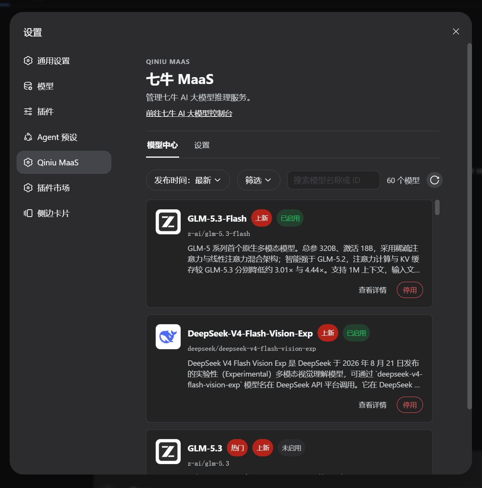
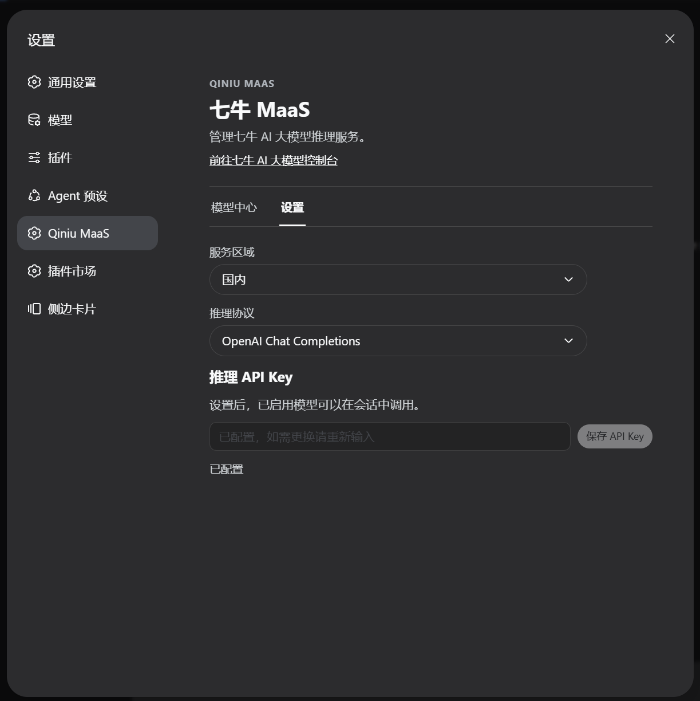
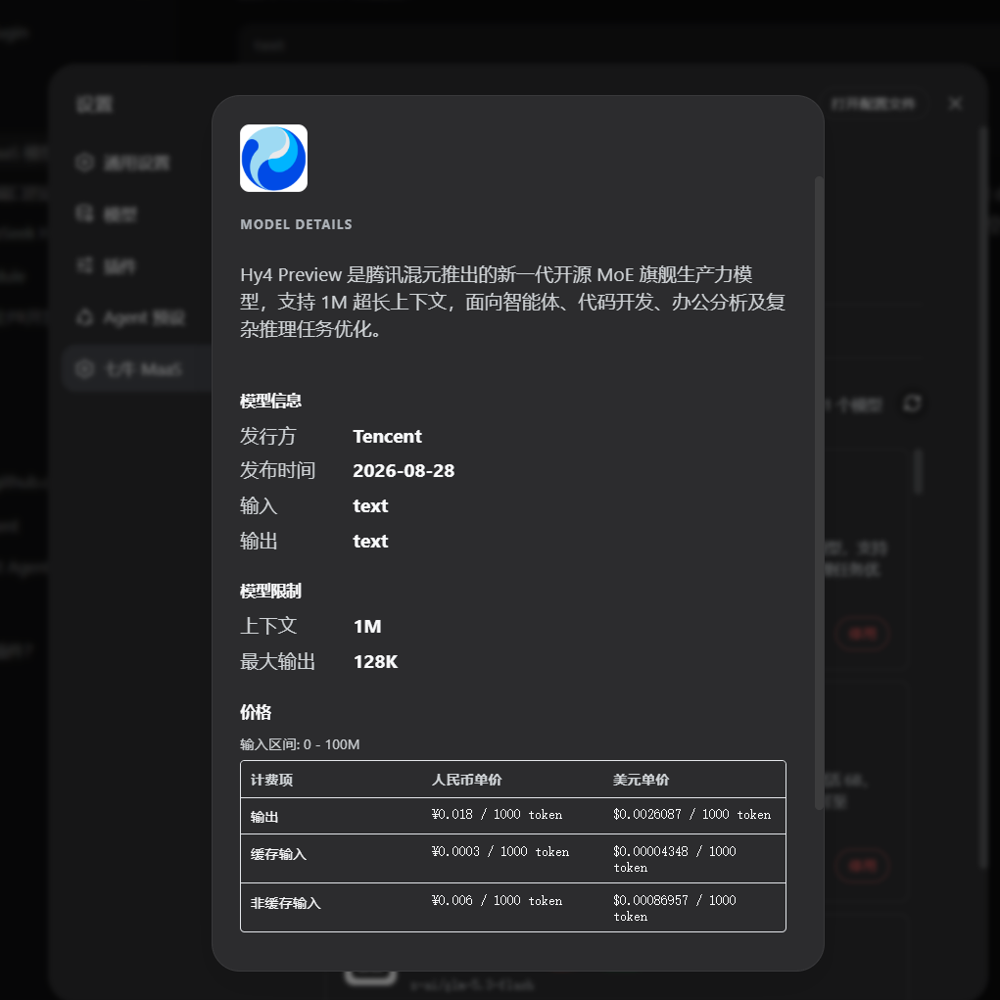

# 七牛 MaaS DSH 插件

七牛 MaaS 是一个面向 DeepSeek Harness（DSH）的 AI 大模型服务插件。安装后，可以在 DSH 中浏览七牛模型市场，选择可用模型，并在会话模型选择器中直接使用这些模型。

## 功能

- 浏览七牛 MaaS 模型市场及模型详情。
- 启用或停用模型，并同步到 DSH 会话模型列表。
- 展示模型图标、热门标签、上下文长度、能力和定价等信息。
- 标识已启用模型和已退役模型；退役模型不可新启用，并提示迁移建议。
- 配置七牛 MaaS API Key、服务区域和推理协议。
- 支持国内和全球服务区域，以及 OpenAI Chat Completions、OpenAI Responses 和 Anthropic Messages 协议。

模型市场使用公开接口，模型发现由 Client 直接完成。实际推理使用 DSH 原生 `llm` provider，不在插件中实现另一套推理客户端。

## 界面预览

|                            模型中心                            |                          设置                          |                            模型详情                            |
| :------------------------------------------------------------: | :----------------------------------------------------: | :------------------------------------------------------------: |
|  |  |  |

## 安装

当前推荐从 GitHub Release 安装插件 tarball：

插件包名为 `@qiniu/dsh-qiniu-maas-plugin`，当前版本为 `0.1.2`。该包通过 GitHub Release 分发，不发布到 npm。

```sh
npx -p @deepseek-ai/dsh dsh plugin --profile web add \
  https://github.com/zhangzqs/dsh-qiniu-maas-plugin/releases/download/v0.1.2/qiniu-dsh-qiniu-maas-plugin-0.1.2.tgz
```

安装完成后重启对应的 DSH profile。插件的 SDK 代码已经内联到插件 bundle 中，不需要单独安装 `qiniu-maas-market-sdk`。

## 配置

1. 打开 DSH 的设置页面，进入“七牛 MaaS”设置区域。
2. 设置七牛 AI 大模型服务 API Key：可以在页面输入并保存，也可以通过环境变量注入。
3. 选择模型市场和推理使用的服务区域：国内或全球。
4. 选择与服务配置匹配的推理协议。
5. 进入“模型中心”，刷新模型列表并启用需要的模型。
6. 返回会话界面，在模型选择器中选择已启用的模型。

### 通过环境变量配置 API Key

插件使用 `QINIU_MAAS_API_KEY` 作为 DSH credentials 引用名。将它设置在运行 Harness 的进程环境中即可：

```sh
export QINIU_MAAS_API_KEY='你的七牛 API Key'
```

如果 Harness 由 systemd 管理，可以使用单独的环境文件：

```ini
# /etc/deepseek-harness/qiniu-maas.env
QINIU_MAAS_API_KEY=你的七牛 API Key
```

然后在 service 的 `[Service]` 段加入：

```ini
EnvironmentFile=/etc/deepseek-harness/qiniu-maas.env
```

建议将环境文件权限设为 `600`。环境变量来源会覆盖 DSH 中保存的同名凭证，并且是只读来源；如果需要在设置页面更换 API Key，应先移除环境变量配置。

API Key 由 DSH credentials 管理，插件不会展示已保存的完整密钥。服务和模型相关信息可以在[七牛 AI 大模型控制台](https://portal.qiniu.com/ai-inference/model)查看。

模型中心中的“启用/停用”是本地 DSH 配置，不代表远程控制台中的模型开通或停用。含有 `suggested_model` 的模型视为已退役，不能新启用，应按照页面提示迁移到建议模型。

## 开发

### 环境

- Node.js：以根目录 `.nvmrc` 为准。
- pnpm：以根目录 `package.json` 的 `packageManager` 为准。

安装依赖：

```sh
pnpm install --frozen-lockfile
```

常用检查：

```sh
pnpm format:check
pnpm lint
pnpm test
pnpm typecheck
pnpm build
```

构建结果位于各包的 `lib/` 目录。插件的 DSH Client 入口由 `lib/client.js` 提供，Host bundle 配置由 `cordis.patch.yml` 提供。

## 项目结构

```text
packages/
├── dsh-qiniu-maas-plugin/  DSH 插件，负责 UI、配置和 provider 同步
└── qiniu-maas-market-sdk/  七牛模型市场 API 的轻量请求与类型 SDK
```

SDK 只负责公开模型市场接口、模型类型和区域服务地址，不依赖 DSH，不保存凭证，也不负责模型推理。插件负责 DSH 集成、设置持久化、API Key 配置接入和会话模型列表同步。

## 发布

Release workflow 监听 `v*` tag。发布流程如下：

1. 在 PR 中更新 `packages/dsh-qiniu-maas-plugin/package.json` 的版本号并合并到 `main`。
2. 基于合并后的提交创建并推送对应 tag：

```sh
git tag -a v0.1.2 -m "release: 七牛 MaaS DSH 插件 v0.1.2"
git push origin v0.1.2
```

GitHub Actions 会自动执行格式检查、Lint、测试、类型检查和构建，校验 tag 版本与 `packages/dsh-qiniu-maas-plugin/package.json` 一致，生成独立的 `.tgz` 安装包并创建 GitHub Release。

## 安全边界

- API Key 通过 DSH credentials 管理，可以在设置页面保存或通过环境变量注入，不写入普通 settings、日志、URL 或构建产物。
- 插件不实现 AK/SK、管理鉴权、API Key 列表或远程模型启停。
- 不要把真实 API Key、测试凭证或 Authorization header 提交到仓库。

## 相关链接

- [七牛 AI 大模型控制台](https://portal.qiniu.com/ai-inference/model)
- [DeepSeek Harness](https://github.com/deepseek-ai/deepseek-harness)
- [七牛 MaaS 插件 Releases](https://github.com/zhangzqs/dsh-qiniu-maas-plugin/releases)
